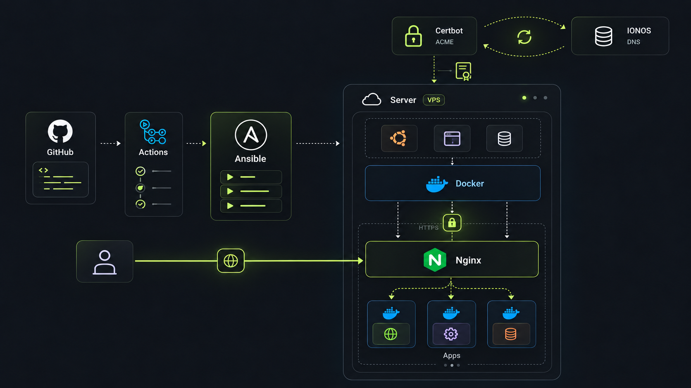

## Reproducible infrastructure

Cloud Platform starts with a concrete need: being able to replace a server, reinstall it or recover from a problem and deploy my services again from a known configuration. I want infrastructure I can rebuild and understand without relying on remembering every adjustment I made to a machine.

GitOps is a methodology that combines declarative state, Git as the central source of truth and automatic synchronisation of infrastructure with the definitions in the repository. The architecture aims to follow these principles: configuration is versioned, and changes trigger its automated application through Ansible. Git makes it possible to review changes, retain their history and restore earlier configurations. Ansible turns those definitions into a reproducible process for preparing a server and deploying services.

The platform separates service configuration from the provider hosting the infrastructure. It can move between compatible environments without tying the project to a particular cloud provider. Each application keeps its own configuration, while the platform handles shared tasks for running services, publishing them and managing certificates.

## Architecture

The architecture has two paths: deploying changes and handling a visit to the website. Following them separately makes each tool's responsibility easier to understand.

- **GitHub Actions** starts the automation and checks the configuration before deployment.
- **Ansible** connects to the server through Secure Shell (SSH) and applies the state defined in the repository.
- **Docker** runs applications in containers.
- **Docker Compose** describes each application's images, networks and services.
- **Nginx** receives visits and routes them to the appropriate application according to the domain.
- **Certbot and IONOS** obtain and renew the certificates Nginx uses to provide HTTPS.

A container image is the package used to distribute an application. Cloud Platform downloads images already published to GitHub Container Registry (GHCR). Building the code belongs to each application's repository. This separation allows a service to be updated without combining its development with infrastructure configuration.

## Request path

<ol class="case-study-flow" aria-label="Request path">
  <li><strong>Visitor</strong>HTTPS request</li>
  <li><strong>Nginx</strong>Certificate and domain</li>
  <li><strong>Docker network</strong>Internal communication</li>
  <li><strong>Application</strong>Service response</li>
</ol>

The Domain Name System (DNS) directs the domain to the server. There, Nginx receives requests and redirects HTTP traffic to HTTPS, establishing an encrypted connection with the visitor using the domain's certificate.

It then forwards the request to the appropriate container through an internal Docker network. The application receives traffic through the proxy without having to expose its port directly to the outside. This centralises service publication and certificate management.

## Declarative deployment

The repository describes the **desired state**: which applications should run and with what configuration. Changes to the platform configuration trigger an automated deployment.

Ansible checks server compatibility and organises deployment into four stages:

1. **Docker:** installs the container tools and prepares the required networks.
2. **Certificates:** configures Certbot and requests the certificates needed for the domains.
3. **Applications:** discovers their definitions, downloads images and applies each Docker Compose project.
4. **Nginx:** generates configurations for each domain, checks their validity and activates the shared proxy.

This order resolves dependencies: applications need the container environment, and Nginx needs certificates and the configuration of the services it will publish.

This approach uses Git as the reference for deployments. Ansible reapplies the declared configuration on each run, although the server does not continuously watch the repository. Manual changes are corrected on the next deployment to the extent that the automation covers them.

## Version control

Application images combine a readable version with a digest calculated using SHA-256. A reference looks like `application:v1.2.3@sha256:…`: the tag communicates the version, and the digest identifies the requested content.

This makes an update reviewable in Git and specifies which image should run, even if a registry tag is moved later. To return to an earlier version, I can restore its reference and deploy again, provided that image remains available.

- **Version (`v1.2.3`):** identifies the published version for the person reviewing the change.
- **Digest (`sha256:…`):** identifies the content Docker should download.

Pinning by digest precisely identifies application images. Reproducing the entire environment also depends on the versions of the tools and packages that make it up.

## HTTPS certificates

To provide HTTPS, the server needs a certificate that establishes its identity for the domain. Certbot requests it through the Automatic Certificate Management Environment (ACME) protocol and uses the IONOS DNS API to demonstrate control of that domain.

DNS validation allows certificates for the domains to be obtained before Nginx starts. Publishing a service still requires its DNS record and proxy configuration.

The automation requests the necessary certificates and enables periodic renewal independently of application deployments. Certbot manages the certificates, and the proxy uses them in read-only mode. A reload allows Nginx to use renewed certificates.

Certificate management also requires coordinating changes in coverage: adding domains to the configuration must be accompanied by issuing or updating the corresponding certificate.

## Adding applications

Each application brings together its manifest, its Docker Compose definition and, when it needs public access, an Nginx template. Ansible discovers those definitions in the repository without requiring each project to be added to a central task list.

| Configuration | Responsibility |
| --- | --- |
| Application manifest | Describes how the application integrates with the platform. |
| Docker Compose definition | Defines the application's runtime environment. |
| Nginx template | Configures public access to the service. |

This structure separates each project's configuration from the platform's shared tasks. An application can deploy internal services without generating a public route in Nginx.

Each Docker Compose project can group multiple services. If an application needs a database, it can define its own network for it and connect the request-handling service to the proxy.
